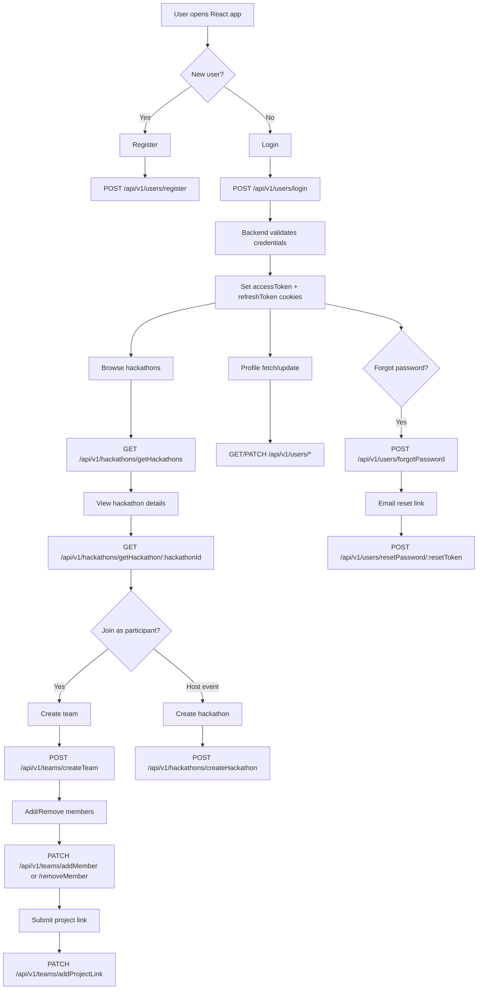

# HackifyLeague

HackifyLeague is a full-stack hackathon management platform where users can discover hackathons, host events, create teams, add teammates, and manage profiles.

## Table of Contents
- [Project Overview](#project-overview)
- [Key Features](#key-features)
- [Tech Stack](#tech-stack)
- [Repository Structure](#repository-structure)
- [System Architecture](#system-architecture)
- [End-to-End Flow Diagram](#end-to-end-flow-diagram)
- [API Overview](#api-overview)
- [Local Setup](#local-setup)
- [Environment Variables (Backend)](#environment-variables-backend)
- [Run the Project](#run-the-project)
- [Important Link](#important-link)

## Project Overview
HackifyLeague supports two major user journeys:
1. **Participants** can register/login, browse hackathons, form teams, and submit project links.
2. **Organizers** can host hackathons and manage event details.

The project currently contains:
- **Web frontend**: React app (`Frontend/hackify`)
- **Backend API**: Node.js + Express + MongoDB (`backend`)
- **Flutter app scaffold/prototype**: (`Hackify Flutter`)

## Key Features
- User registration and login with JWT-based authentication
- Cookie-based session handling (access + refresh token)
- Forgot-password and reset-password flow via email
- User profile management and avatar upload
- Hackathon creation, listing, details, and update
- Team creation per hackathon
- Team member add/remove workflows
- Team project link submission
- Search support for users and hackathons

## Tech Stack
### Frontend
- React 18
- React Router DOM
- Axios
- Material UI
- Bootstrap
- Tailwind CSS

### Backend
- Node.js
- Express
- MongoDB + Mongoose
- JWT (authentication)
- bcrypt (password hashing)
- cookie-parser, cors
- multer + Cloudinary (file uploads)
- nodemailer (email for reset password)

## Repository Structure
```text
HackifyLeague/
├── README.md
├── Frontend/
│   └── hackify/                 # React web app
│       ├── src/
│       │   ├── Components/
│       │   ├── Context/
│       │   └── App.js
│       └── package.json
├── backend/                     # Express + MongoDB API
│   ├── src/
│   │   ├── controller/
│   │   ├── db/
│   │   ├── middlewares/
│   │   ├── models/
│   │   ├── routes/
│   │   ├── utils/
│   │   ├── app.js
│   │   └── index.js
│   ├── .env.sample
│   └── package.json
└── Hackify Flutter/             # Flutter project scaffold
```

## System Architecture
- **Frontend (React)** handles UI, route navigation, forms, and API calls.
- **Backend (Express)** exposes REST APIs under `/api/v1/*`.
- **Auth middleware** protects secure routes using JWT from cookies.
- **MongoDB** stores users, hackathons, and teams.
- **Cloudinary** stores avatar images.
- **Nodemailer** sends password-reset emails.

## End-to-End Flow Diagram


### Flow Explanation
1. User lands on the React app and either registers or logs in.
2. Backend validates credentials and returns JWT tokens via cookies.
3. Authenticated users can browse hackathons and open details.
4. Participants can create a team, manage members, and submit project links.
5. Organizers can create and update hackathons.
6. Users can fetch/update profile details and avatar.
7. If needed, password reset is handled through email token flow.

## API Overview
### User Routes (`/api/v1/users`)
- `POST /register`
- `POST /login`
- `POST /refresh-token`
- `POST /forgotPassword`
- `POST /resetPassword/:resetToken`
- `GET /searchUser` (protected)
- `POST /logout` (protected)
- `GET /getUser` (protected)
- `PATCH /changePassword` (protected)
- `PATCH /changeAccountDetails` (protected)
- `PATCH /uploadAvatarImage` (protected)
- `PATCH /updateAvatarImage` (protected)

### Hackathon Routes (`/api/v1/hackathons`)
- `POST /createHackathon`
- `GET /getHackathons`
- `GET /getHackathon/:hackathonId`
- `PATCH /updateHackathon/:hackathonId` (protected)
- `GET /searchHackathon` (protected)

### Team Routes (`/api/v1/teams`)
- `POST /createTeam` (protected)
- `PATCH /addMember` (protected)
- `PATCH /removeMember` (protected)
- `PATCH /addProjectLink` (protected)
- `GET /getTeam/:teamId` (protected)
- `GET /getTeam/:hackathonID` (protected)

## Local Setup
### 1) Clone and install dependencies
From repository root:
```bash
npm install
cd /home/runner/work/HackifyLeague/HackifyLeague/backend && npm install
cd /home/runner/work/HackifyLeague/HackifyLeague/Frontend/hackify && npm install
```

### 2) Configure backend environment
Create `/home/runner/work/HackifyLeague/HackifyLeague/backend/.env` using `.env.sample` and add all required values.

## Environment Variables (Backend)
Use these in `backend/.env`:

```env
PORT=8080
CORS_ORIGIN=http://localhost:3000
MONGODB_CONNECTION_URI=

ACCESS_TOKEN_SECRET=
ACCESS_TOKEN_EXPIRY=
REFRESH_TOKEN_SECRET=
REFRESH_TOKEN_EXPIRY=

FRONTEND_URL=http://localhost:3000
EMAIL_USER=
APP_PASSWORD=

CLOUDINARY_CLOUD_NAME=
CLOUDINARY_API_KEY=
CLOUDINARY_API_SECRET=

SALT_ROUNDS=
```

## Run the Project
### Start backend
```bash
cd /home/runner/work/HackifyLeague/HackifyLeague/backend
npm run dev
```

### Start frontend
```bash
cd /home/runner/work/HackifyLeague/HackifyLeague/Frontend/hackify
npm run dev
```

Frontend default: `http://localhost:3000`  
Backend default: `http://localhost:8080`

## Important Link
- System design (Eraser): https://app.eraser.io/workspace/kUDVYxzi2dHbUPg4jY6V
